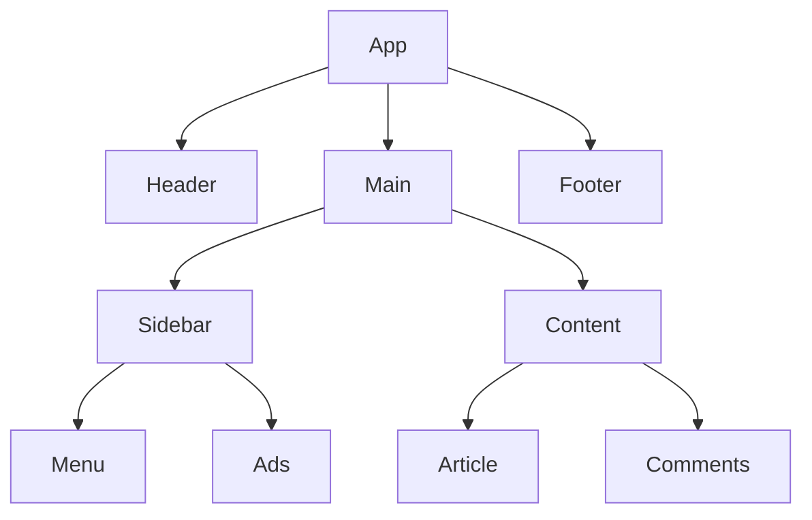
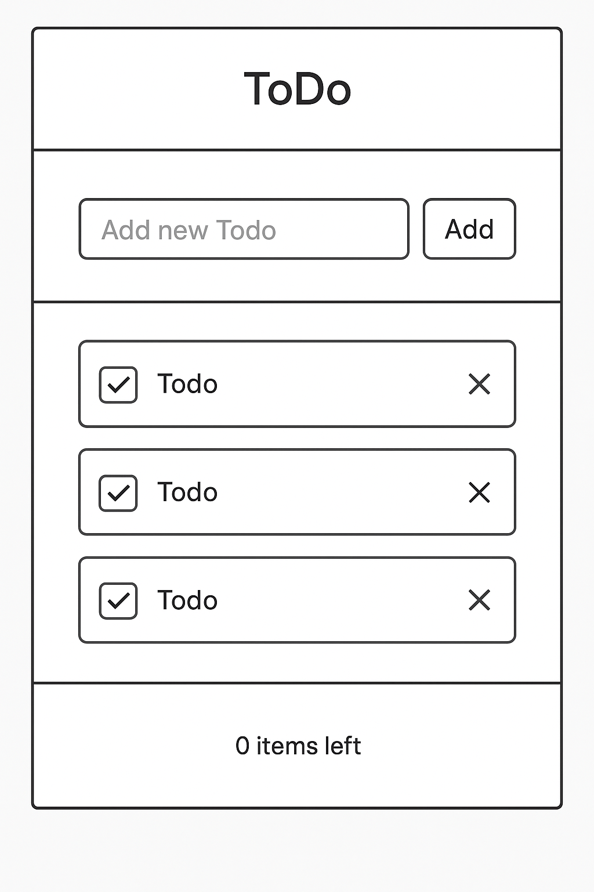
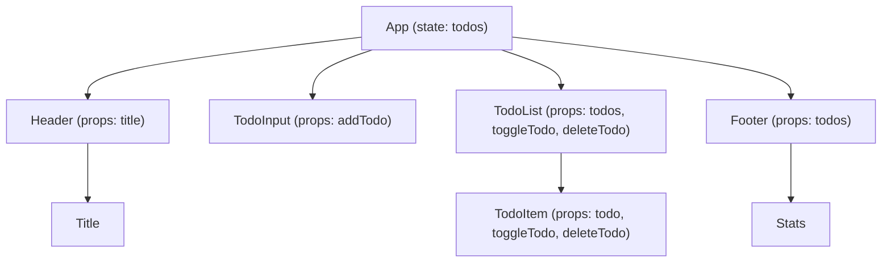

# Core React Essentials

These are the fundamental concepts needed to build and understand React applications.

---

## 1. Components
React apps are built from **components** — small, reusable pieces of UI.

    function Welcome() {
      return <h1>Hello!</h1>;
    }

---



**Explanation:**

- `App` is the root component.
- `Header`, `Main`, `Footer` are top-level children.
- `Main` contains `Sidebar` and `Content`.
- `Content` contains `Article` and `Comments`.
- `Sidebar` contains `Menu` and `Ads`.

This shows **parent-child relationships** and how the UI can be structured into reusable components.  


**Real Application Example**

---



----




**Explanation:**

- **App** holds the main state: `todos`.
- **Props** flow **downwards** from `App` to child components:
  - `Header` receives `title`.
  - `TodoInput` receives `addTodo` function to add new todos.
  - `TodoList` receives the `todos` array and functions to toggle/delete todos.
  - Each `TodoItem` receives its individual `todo` data and the functions to interact with it.
- `Footer` receives `todos` to calculate completed/total stats.

This diagram clearly visualizes **stateful vs stateless components** and **parent → child data flow**, which is a core React concept.  


## 2. JSX
## ⚛️ What is JSX?

**JSX (JavaScript XML)** is a **syntax extension** for JavaScript that lets you **write HTML-like code inside React**.  
It makes UI code more **readable** and **declarative**, allowing you to describe what the interface should look like directly within JavaScript.

---

### 🧠 Key Points
- Looks like HTML but compiles to **React.createElement()** calls.
- You can embed **JavaScript expressions** inside `{}`.
- Every JSX element must have **one parent element**.


---

### 💡 Example

```jsx
function Greeting() {
  const name = "Andrey";
  return <h1>Hello, {name}!</h1>;
}
```

---

## 3. Props
## 🧩 What Are Props in React?

**Props** (short for **properties**) are a way to pass **data** and **functions** from a **parent component** to a **child component** in React.

They make components **reusable** and **dynamic** by allowing customization through input values.

---

### 🧠 Key Points
- Props are **read-only** (immutable) within the child component.
- They are passed like **attributes** in HTML.
- They help keep components **modular** and **declarative**.

---

### 🧮 Example

```jsx
function Welcome(props) {
  return <h1>Hello, {props.name}!</h1>;
}

function App() {
  return <Welcome name="Andrey" />;
}
```
### 🧩 Examples of Different Syntax for Using Props in React

Props can be passed and accessed in several ways.  
Here are the most common syntax patterns you’ll encounter 👇

---

##### 🧱 1. Basic Prop Passing

```jsx
function Welcome(props) {
  return <h1>Hello, {props.name}!</h1>;
}

function App() {
  return <Welcome name="Andrey" />;
}
```
##### 🧾 2. Destructuring Props (Preferred)

```jsx
function Welcome({ name }) {
  return <h1>Hello, {name}!</h1>;
}

function App() {
  return <Welcome name="Maria" />;
}

//multiple properties
function UserCard({ name, age, city }) {
  return (
    <p>
      {name}, {age} years old, from {city}.
    </p>
  );
}

function App() {
  return <UserCard name="Alex" age={28} city="Montreal" />;
}


```
##### ⚙️ 4. Passing Functions as Props (Event Handlers)
```jsx
function Button({ onClick }) {
  return <button onClick={onClick}>Click Me</button>;
}

function App() {
  const handleClick = () => alert("Button clicked!");
  return <Button onClick={handleClick} />;
}
```
##### 🧩 5. Passing Objects or Arrays as Props
```jsx
function Profile({ user }) {
  return <p>{user.name} - {user.email}</p>;
}

function App() {
  const userData = { name: "Sophie", email: "sophie@example.com" };
  return <Profile user={userData} />;
}
```
##### 🌈 6. Children Prop (Special Built-in Prop)
```jsx
function Card({ children }) {
  return <div className="card">{children}</div>;
}

function App() {
  return (
    <Card>
      <h2>Title</h2>
      <p>This content is passed as children.</p>
    </Card>
  );
}
```


---


## ⚡ 4. Event Handling

In React, **events** let your components respond to user actions such as clicks, typing, hovering, or submitting forms.

React events look similar to DOM events, but with a few key differences:

- Event names are written in **camelCase** (e.g., `onClick`, `onChange`).
- You pass **functions**, not strings (e.g., `onClick={handleClick}`).
- Events help React re-render components with updated state.

## ⚛️ React Hooks

**React Hooks** are special functions that let you “hook into” React features like state and lifecycle methods in functional components. They allow functional components to manage state, side effects, context, refs, and more, without writing class components.

**Advantages:**
- Avoids boilerplate code from class components.
- Makes code more readable and reusable.
- Encourages functional programming style.

**Common Hooks:**
- `useState` – manages state in functional components.
- `useEffect` – handles side effects like API calls or subscriptions.
- `useContext` – accesses React context.
- `useRef` – references DOM elements or stores mutable values.
- `useReducer` – manages complex state logic.

---

### ⚙️ `useState` Hook

**`useState`** is a hook that lets you add state to functional components.  
It returns an array with two elements:
1. The current state value.
2. A function to update that state.

**Syntax:**
```javascript
const [state, setState] = useState(initialValue)
```

#### 🧾 Example Counter Using `useState` React Hook

```jsx
function Counter() {
  const [count, setCount] = useState(0);

  function handleClick() {
    setCount(count + 1);
  }

  return (
    <button onClick={handleClick}>
      Clicked {count} times
    </button>
  );
}
```

---

## 6. Rendering & Re-rendering
React re-runs a component whenever:
- Its **state** changes
- Its **props** change

UI = **function of state**

---

## 7. Lists & Keys
When rendering lists, always use a **unique key**.

    {items.map(item => (
      <Item key={item.id} {...item} />
    ))}

---

## 8. useEffect (Side Effects)

    useEffect(() => {
      fetchData();
    }, []);

Used for:
- Data fetching
- Subscriptions
- Timers
- Lifecycle management

---

## 9. Component Composition
Build UI like **LEGO**:
- Small components combine into larger ones
- Data flows **down** via props
- Events send data **up**

---

## 10. Routing (Navigation)

    <Route path="/profile" element={<Profile />} />

---

# What This Enables
By mastering these essentials, you can:
- Build real applications
- Transition to React Native easily
- Understand and debug React applications confidently

---

# Advanced (Learn After Fundamentals)

| Concept | Purpose | Learn When |
|--------|---------|------------|
| Context API | Avoid deep prop drilling | When passing props becomes annoying |
| Reducers / Redux / Zustand | Manage large shared state | Once app grows complex |
| Suspense / Concurrent Mode | Improve UI smoothness | After building a few apps |
| Server Components (Next.js) | Performance + scalability | When comfortable with basics |
