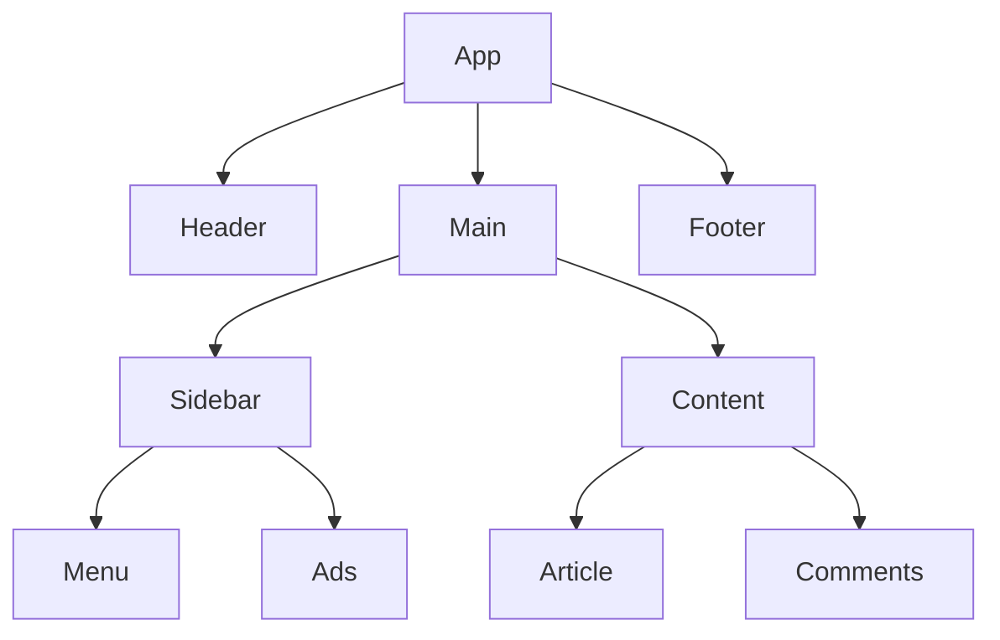
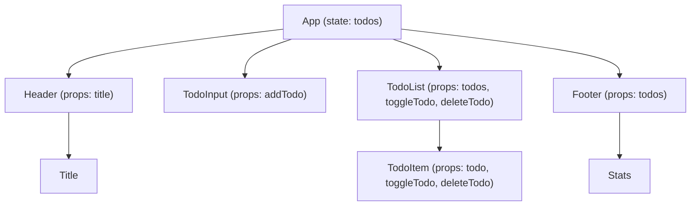

# Core React Essentials

These are the fundamental concepts needed to build and understand React applications.

---

## 1. Components
React apps are built from **components** — small, reusable pieces of UI.

    function Welcome() {
      return <h1>Hello!</h1>;
    }

---

**Explanation:**

- `App` is the root component.
- `Header`, `Main`, `Footer` are top-level children.
- `Main` contains `Sidebar` and `Content`.
- `Content` contains `Article` and `Comments`.
- `Sidebar` contains `Menu` and `Ads`.

This shows **parent-child relationships** and how the UI can be structured into reusable components.  

**Real Application Example**

---

----

**Explanation:**

- **App** holds the main state: `todos`.
- **Props** flow **downwards** from `App` to child components:
  - `Header` receives `title`.
  - `TodoInput` receives `addTodo` function to add new todos.
  - `TodoList` receives the `todos` array and functions to toggle/delete todos.
  - Each `TodoItem` receives its individual `todo` data and the functions to interact with it.
- `Footer` receives `todos` to calculate completed/total stats.

This diagram clearly visualizes **stateful vs stateless components** and **parent → child data flow**, which is a core React concept.  

## 2. JSX
JSX stands for Javascript extension. JSX lets you write UI syntax that *looks like HTML* inside JavaScript. It compiles to plain JS.

    
Hello

Becomes:

    React.createElement("div", null, "Hello");

---

## 3. Props
**Props = data passed from parent → child components**

    function Welcome({ name }) {
      return <h1>Hello, {name}</h1>;
    }

---

## 4. State
State stores **data that changes over time**. Updating state triggers a re-render.

    const [count, setCount] = useState(0);

---

## 5. Event Handling
Events update state which updates UI automatically.

    <button onClick={() => setCount(count + 1)}>Add</button>

---

## 6. Rendering & Re-rendering
React re-runs a component whenever:
- Its **state** changes
- Its **props** change

UI = **function of state**

---

## 7. Lists & Keys
When rendering lists, always use a **unique key**.

    {items.map(item => (
      <Item key={item.id} {...item} />
    ))}

---

## 8. useEffect (Side Effects)

    useEffect(() => {
      fetchData();
    }, []);

Used for:
- Data fetching
- Subscriptions
- Timers
- Lifecycle management

---

## 9. Component Composition
Build UI like **LEGO**:
- Small components combine into larger ones
- Data flows **down** via props
- Events send data **up**

---

## 10. Routing (Navigation)

    <Route path="/profile" element={<Profile />} />

---

# What This Enables
By mastering these essentials, you can:
- Build real applications
- Transition to React Native easily
- Understand and debug React applications confidently

---

# Advanced (Learn After Fundamentals)

| Concept | Purpose | Learn When |
|--------|---------|------------|
| Context API | Avoid deep prop drilling | When passing props becomes annoying |
| Reducers / Redux / Zustand | Manage large shared state | Once app grows complex |
| Suspense / Concurrent Mode | Improve UI smoothness | After building a few apps |
| Server Components (Next.js) | Performance + scalability | When comfortable with basics |
